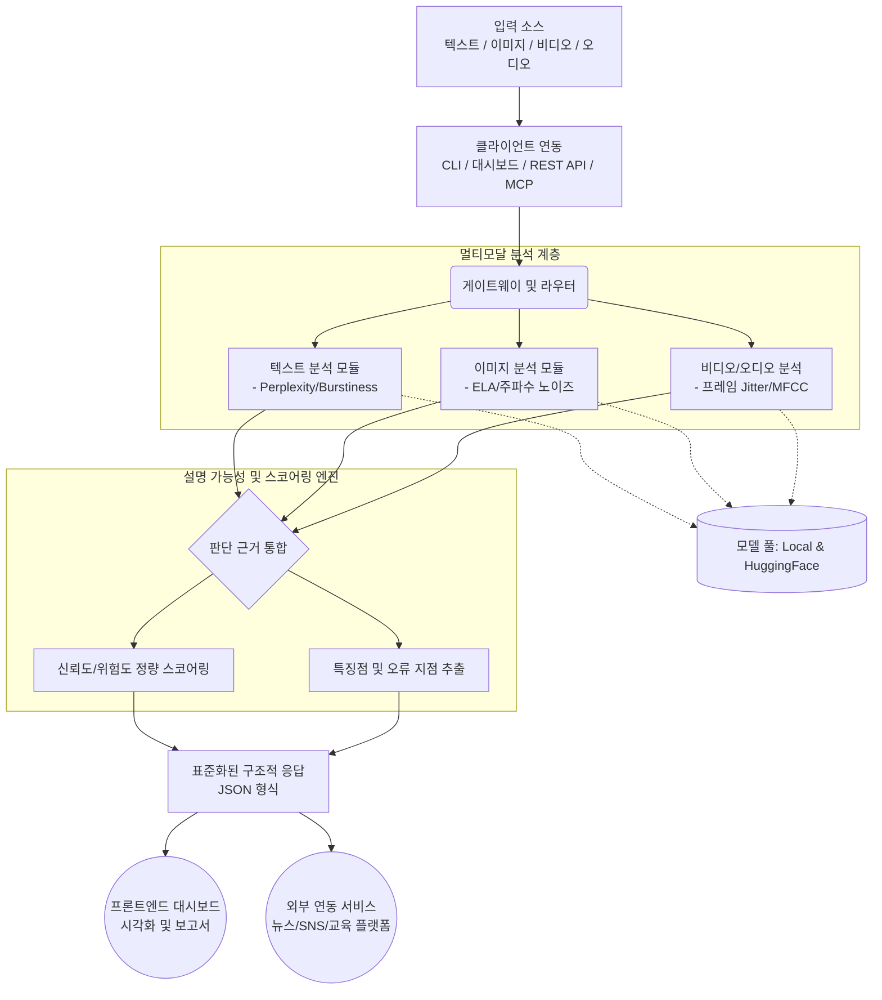

# TruthGuard SDK 프로젝트 분석 및 파이프라인

## 1. 프로젝트 주요 주제 (3대 핵심 주제 및 하위 주제)

TruthGuard SDK의 전체적인 아키텍처와 목적을 기반으로 프로젝트를 3가지 큰 주제와 세부 주제로 구조화할 수 있습니다.

### 📌 주제 1: 멀티모달 콘텐츠 탐지 및 분석 (Multimodal Content Detection)
AI가 생성한 다양한 형태의 콘텐츠를 정밀하게 식별하고 변조 여부를 분석하는 핵심 엔진입니다.
* **텍스트 분석 (Text)**: Perplexity, Burstiness 등을 산출하여 생성형 AI가 작성한 텍스트인지(가짜뉴스/환각) 판별
* **이미지 분석 (Image)**: ELA 압축 왜곡 검출, 주파수 노이즈 분석, 얼굴 랜드마크 비교를 통한 딥페이크 탐지
* **비디오/오디오 분석 (Video/Audio)**: 프레임 간 일관성(Jitter) 감지, HNR/MFCC 기반 인공 음성 감지

### 📌 주제 2: XAI(설명 가능한 AI) 기반 신뢰도 스코어링 (XAI & Reliability Scoring)
단순한 참/거짓 판단을 넘어, 시스템의 판단 근거를 사용자(개발자)가 납득할 수 있도록 구조화된 지표로 제공합니다.
* **정량적 스코어링**: 콘텐츠별 신뢰도 점수 및 위험도 수치화 기능
* **판단 근거 추출 (Explainability)**: 탐지된 특징점이나 문맥적 오류 지점을 명확히 제공하여 분석 투명성 확보
* **구조화된 포맷팅 (JSON 반환)**: 외부 시스템에서 파싱하기 쉽도록 XAI 기반 탐지 결과를 JSON 형태로 표준화

### 📌 주제 3: 유연한 통합 환경 및 시스템 확장성 (Integration & Scalability)
개발자가 자사 인프라에 쉽게 임베딩할 수 있도록 유연한 아키텍처와 확장성을 제공합니다.
* **사용자 친화적 인터페이스**: 단일 CLI 도구(`tg scan`) 및 REST API, 대시보드를 통한 즉각적인 검증 지원
* **플러그인 및 모델 확장 (Model Agnostic)**: 내부 경량 모델부터 Hugging Face 등 외부 거대 모델까지 교체 가능한 아키텍처
* **Agentic AI 연동 (MCP)**: MCP(Model Context Protocol) 서버를 지원하여 Claude 등 LLM 에이전트와 직접 통신 및 자율적 정보 검증 연동

---

## 2. 데이터 처리 및 분석 파이프라인 (Data Pipeline)

아래는 콘텐츠가 입력되어 TruthGuard 시스템을 거쳐 최종 결과(스코어 및 근거)로 출력되기까지의 과정을 나타낸 파이프라인 다이어그램입니다.

