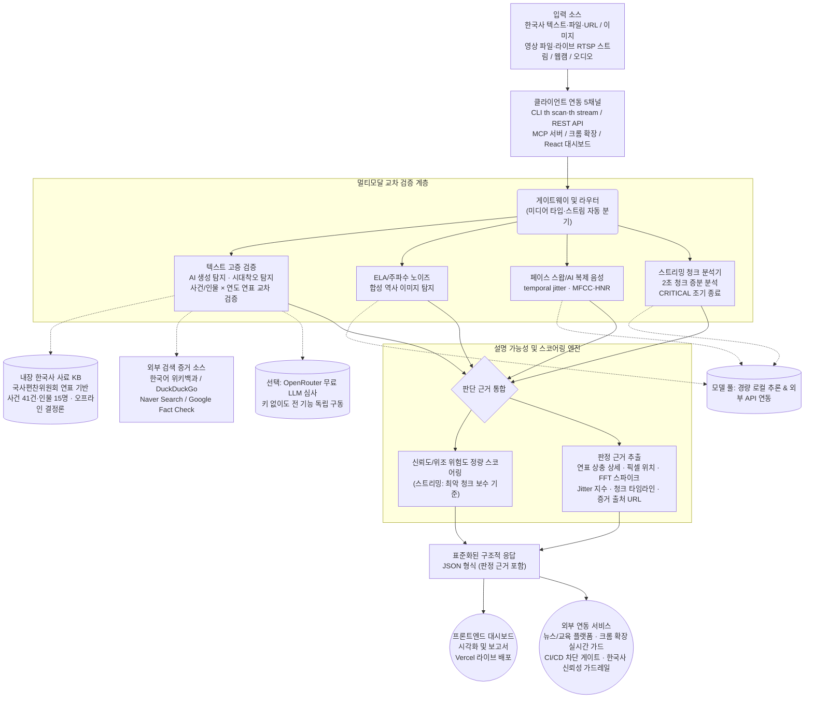

# Truth History SDK 프로젝트 분석 및 파이프라인

## 1. 프로젝트 주요 주제 (3대 핵심 주제 및 하위 주제)

Truth History SDK는 생성형 AI로 인한 **한국 역사 할루시네이션(그럴듯하지만 거짓인 역사 정보 대량 생성)** 및 **멀티미디어 위변조(역사 사진 합성·딥페이크 페이스 스왑·AI 복제 음성)** 리스크에 대응합니다. 텍스트·시청각 교차 검증 모델을 단일 SDK로 통합한 전체 아키텍처와 목적을 기반으로, 프로젝트를 3가지 큰 주제와 세부 주제로 구조화할 수 있습니다.

### 📌 주제 1: 멀티모달 콘텐츠 탐지 및 분석 (Multimodal Content Detection)
생성형 AI로 왜곡·위조된 다양한 형태의 한국 역사 콘텐츠를 정밀하게 식별하고 변조 여부를 교차 검증하는 핵심 엔진입니다.
* **텍스트 고증 검증 (Text)**: Perplexity, Burstiness 등을 산출하여 생성형 AI가 작성한 한국사 텍스트인지(역사 할루시네이션) 판별하고, **내장 한국사 사료 지식베이스**(국사편찬위원회 「한국사연표」 기반 사건 41건·인물 15명 — 네트워크·API 키 없이 **오프라인에서 '사건/인물 × 연도(세기)' 주장을 즉시 교차 검증**하는 `truthhistory-kb` 증거 소스)와 한국어 위키백과·DuckDuckGo·Naver Search·Google Fact Check **외부 검색 증거 병렬 교차 검증**으로 역사적 정합성 검증. **시대착오(Anachronism) 할루시네이션 탐지**(현대 기기·대상 × 역사 인물·시대 동시 등장 → 정정 여부에 따라 정합성 상한/강력 의심 플래그) + **(선택) OpenRouter 무료 LLM 고증 심사**(`:free` 모델 심사관 — 키가 없어도 전 핵심 기능이 동작하는 독립 구동 경로 유지)
* **ELA 이미지 합성 탐지 (Image)**: Error Level Analysis 압축 왜곡 검출 + FFT 주파수 노이즈 분석(GAN/Diffusion 격자 아티팩트)을 통한 위조·합성 역사 이미지 탐지
* **딥페이크 페이스 스왑 + AI 복제 음성 (Video/Audio)**: 안면 랜드마크 비대칭 및 프레임 간 temporal jitter로 페이스 스왑 탐지, MFCC/HNR 주파수 분석으로 인물 사칭·허위 역사 발언 유포용 AI 복제 음성 탐지. **스트리밍 청크 증분 분석기**(`th stream` / `POST /api/v1/scan/stream`)로 라이브 RTSP/HTTP 스트림·장문 영상·웹캠을 시간 청크(기본 2초) 단위로 실시간 검증 — CRITICAL 청크 조기 종료, 종합 판정은 최악 청크 보수 기준

### 📌 주제 2: XAI(설명 가능한 AI) 기반 신뢰도 스코어링 (XAI & Reliability Scoring)
단순한 참/거짓 판단을 넘어, 시스템의 판단 근거를 사용자(개발자)가 납득할 수 있도록 구조화된 지표로 제공하여 **한국 역사 데이터 안전 가드레일**을 투명하게 구축합니다.
* **정량적 스코어링**: 텍스트·이미지·영상·오디오별 신뢰도 점수 및 위조 위험도 수치화
* **판단 근거 추출 (Explainability)**: ELA 편차·바운딩 박스(픽셀 위치), FFT 주파수 노이즈 스파이크 패턴, 안면 랜드마크 오프셋 등 탐지된 특징점과 역사적 오류 지점을 명확히 제공하여 분석 투명성 확보
* **구조화된 포맷팅 (JSON 반환)**: 외부 시스템이 파싱하기 쉽도록 XAI 기반 탐지 결과(판정 근거 포함)를 JSON 형태로 표준화

### 📌 주제 3: 유연한 통합 환경 및 시스템 확장성 (Integration & Scalability)
뉴스·SNS·교육 시스템 등 누구나 자사 인프라에 한국 역사 신뢰성 검증을 손쉽게 임베딩·확장할 수 있는 유연한 아키텍처를 제공합니다.
* **사용자 친화적 인터페이스 (5개 채널)**: 통합 CLI(`th scan`·`th stream`·`th mcp`), REST API(`/api/v1/scan/{text,url,media,stream}`), MCP 서버(LLM 에이전트 직접 연동), **크롬 확장 프로그램**(ChatGPT/Claude/Gemini/AI Studio 실시간 배지 + 모든 사이트 우클릭 검사 — Vercel 배포 백엔드 자동 사용), React 대시보드를 통한 즉각적인 교차 검증 지원. CLI 종료 코드(0=정상/1=변조 의심/2=오류)로 CI/CD 자동 차단 게이트로 직접 적용 가능
* **지연 로딩 모듈러 + 오프라인 우선 혼합 추론 (Model Agnostic)**: 지연 로딩(Lazy Loading) 모듈러 구조로 필요한 모듈만 적재하며, **내장 KB·규칙·신호 분석이 기본 경로**(외부 의존 없이 판정 유지)이고 GPT-2 로컬 추론·OpenRouter 무료 LLM 등 외부 경로는 선택 부스트 — 자체 검증 레이어 구축 비용 **80% 이상 절감**
* **Agentic AI 연동 (MCP) + MIT 라이선스**: MCP(Model Context Protocol) stdio 서버(`scan_text` 대표 도구 — 크롬 확장과 동일 모티브의 LLM 답변 실시간 검증, `scan_file` 멀티미디어 지원)로 Claude 등 LLM 에이전트와 직접 통신, MIT 라이선스로 자사 규격에 맞춘 자유로운 임베딩/확장 보장

---

## 2. 데이터 처리 및 분석 파이프라인 (Data Pipeline)

아래는 한국 역사 콘텐츠가 입력되어 Truth History 시스템을 거쳐 최종 결과(신뢰도 스코어 및 판정 근거 JSON)로 출력되기까지의 과정을 나타낸 파이프라인 다이어그램입니다.

