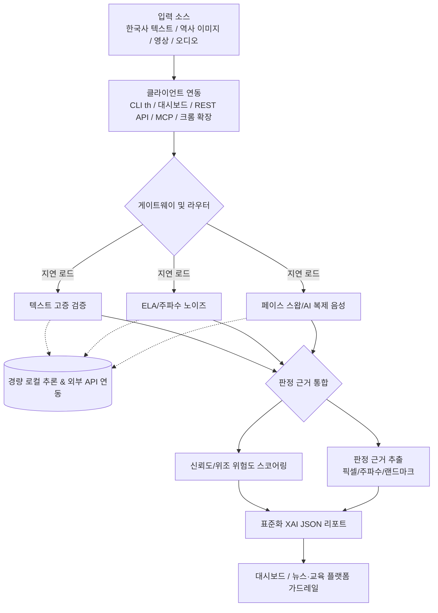

# 중간 보고서 — Truth History SDK

> **생성형 AI 기반 한국사 왜곡·멀티미디어 위변조 통합 탐지 오픈소스 프레임워크**
> Truth History SDK: Korean History Hallucination & Multimedia Manipulation Detection SDK

---

## 1. 프로젝트 개요

| 항목 | 내용 |
| :--- | :--- |
| 프로젝트명 | **Truth History SDK** |
| 한 줄 요약 | 생성형 AI로 인한 한국 역사 할루시네이션과 멀티미디어 위변조를 텍스트·시청각 교차 검증으로 통합 탐지하는 오픈소스 SDK·CLI·웹·확장 프로그램 프레임워크 |
| 라이선스 | MIT |
| 언어/스택 | Python(FastAPI) + TypeScript(React/Vite) + Chrome Extension(MV3) |
| 저장소 | https://github.com/kimneche0419-rgb/TURTH_GUARD (PR #1, `platy` 브랜치) |
| 라이브 데모 | https://platy-rho.vercel.app |

---

## 2. 개발 배경 및 필요성

생성형 AI의 대중화로 두 종류의 리스크가 동시에 급증하고 있다.

1. **한국사 할루시네이션**: LLM이 문장은 매끄럽고 출처까지 그럴듯하게 꾸며냈으나 **사료와 일치하지 않는 거짓 역사 정보**를 대량 생산·유포. 이것이 교육·언론·SNS를 통해 사실처럼 재생산됨.
2. **멀티미디어 위변조**: 역사적 사진 **합성·위조**(GAN/Diffusion), 인물 **딥페이크 페이스 스왑**, 사칭 인물의 **AI 복제 음성** 등이 역사적 사실관계를 교란함.

**기술적 한계**: 기존 오픈소스는 단일 기능(텍스트 분류, 단일 딥페이크 탐지 등)에 **파편화**되어, 하나의 역사 콘텐츠를 텍스트·이미지·영상·오디오에 걸쳐 **교차 검증**할 수 있는 통합 규격이 부재했고, 상용 플랫폼 접근성도 낮았음.

---

## 3. 목표 및 핵심 기능

**단일 SDK로 4대 탐지 모듈을 통합**하고, 탐지 결과의 **판정 근거(XAI)**를 설명 가능한 형태로 제공한다.

| 모듈 | 기능 | 핵심 알고리즘 |
| :--- | :--- | :--- |
| 📝 **텍스트 고증 검증** | 한국사 텍스트의 AI 생성 탐지 + 역사적 정합성 검증 | Perplexity/Burstiness + 어휘 다양도 휴리스틱 + Google Fact Check API/LLM 정합성 평가 + 선동성·출처 신뢰도 |
| 🖼️ **ELA 이미지 합성 탐지** | 위조·합성 역사 이미지 탐지 | Error Level Analysis(압축 왜곡) + FFT 주파수 노이즈(GAN/Diffusion 격자 아티팩트) + 안면 좌우 대칭(Haar Cascade) |
| 🎬 **딥페이크 페이스 스왑 탐지** | 영상 내 안면 합성 탐지 | 프레임 간 Temporal Jitter(Bhattacharyya 거리) + 프레임별 안면 대칭 집계 |
| 🎙️ **AI 복제 음성 탐지** | 합성/클론 음성·사칭 탐지 | MFCC + HNR(Harmonic-to-Noise Ratio) 주파수 분석 + 사칭·위험 어휘 문맥 분석 |

**설명 가능한 판정 근거(XAI)**: 픽셀 위치(ELA 편차/바운딩), 주파수 노이즈 패턴(FFT 스파이크), 안면 랜드마크 오프셋, 문맥적 고증 오류 지점 등을 API/CLI 리포트(JSON)로 명확히 제공.

---

## 4. 시스템 아키텍처

**핵심 설계 원칙**
- **Modular & Pluggable(지연 로딩)**: 무거운 의존성(opencv/torch/librosa)을 `importlib` 지연 임포트로 필요 시점에만 로드.
- **Model Agnostic(경량 로컬 추론 + 외부 API 혼합)**: 비용과 정확도를 모두 잡는 하이브리드 설계.
- **Explainable AI(XAI)**: 단순 Pass/Fail이 아닌 구조화된 판정 근거 제공.

---

## 5. 현재까지의 구현 성과 (진척도)

### 5.1 백엔드 SDK (`truthhistory/` 패키지)
- 4대 분석기(Text/Image/Video/Audio) 구현, 공통 `BaseAnalyzer`/`AnalysisResult`(Pydantic) 규격.
- **stub 구체화**: 이미지·비디오 딥페이크 탐지를 상수 반환 stub에서 **OpenCV Haar Cascade 기반 안면 좌우 대칭 실제 구현**으로 교체(`truthhistory/utils/face.py` 공유 헬퍼, 얼굴 미검출 시 중립 폴백).
- 가중합 신뢰도 스코어링 + 위험도(LOW/MEDIUM/HIGH/CRITICAL) 자동 분류.
- LazyModuleImporter로 의존성 누락 시 사용자에게 설치 안내.

### 5.2 CLI (`th`)
- `th init / dev / api / web / scan / cli / mcp` 통합 명령어. 텍스트·이미지·영상·오디오·URL 자동 분기.
- `text`/`json`/`table` 출력 포맷, CI/CD 연동용 exit code.
- Windows 래퍼(`th.bat`/`th.ps1`)로 가상환경 진입 없이 루트에서 실행.

### 5.3 웹 대시보드 (React/Vite)
- 프리미엄 다크 모드 대시보드. 드래그&드롭 업로드, URL 분석 탭, API Key 입력.
- 신뢰도 게이지·AI 생성 확률 바·XAI 어노말리 경고 카드 시각화.
- 빌드 모드 자동 전환(운영=동일 출처 상대경로 / dev=localhost).

### 5.4 MCP 서버 (`truthhistory_mcp.py`)
- JSON-RPC 2.0 Stdio 기반. LLM 에이전트용 `scan_text`/`scan_file` 도구 노출.

### 5.5 크롬 확장 프로그램 (`extension/`, Manifest V3)
- ChatGPT/Claude/Gemini 어시스턴트 답변을 `MutationObserver`로 관찰 → Truth History 엔진으로 실시간 교차 검증 → **경고 배지** 인라인 삽입.
- 우클릭 컨텍스트 메뉴로 어떤 텍스트든 즉시 검사, 팝업 설정(API 주소·Key·자동스캔).
- **배포된 백엔드 연동 시 로컬 서버 불필요**.

### 5.6 클라우드 배포 (Vercel)
- 단일 프로젝트로 프론트(정적) + 백엔드(`api/index.py` 서버리스) 같은 도메인 운영.
- **라이브**: https://platy-rho.vercel.app ( `/api/v1/scan/text`, `/api/v1/scan/url` 검증 완료 ).
- 서버리스 제약(225MB) 대응: 텍스트 중심 최소 의존성, 읽기전용 FS 패치(`/tmp`).

---

## 6. 검증 결과

| 항목 | 결과 |
| :--- | :--- |
| 단위 테스트 | **16건 전체 통과** (분석기 4종 + CLI 10종 + `/scan/text` 서버 2종) |
| 프론트엔드 타입체크 | `tsc --noEmit` **0건** |
| 확장 프로그램 정적 검증 | manifest JSON + JS(background/content/popup) 문법 통과 |
| 클라우드 배포 | 대시보드 `GET /` 200, 텍스트 API `POST /api/v1/scan/text` 200 + XAI JSON 반환 확인 |
| 버전관리 | PR #1(`platy`→`main`)로 전부 커밋·푸시 |

> 로컬/컨테이너 환경에서는 4대 멀티미디어 모듈이 실 알고리즘으로 동작. 현재 클라우드(Vercel)는 서버리스 한계로 **텍스트·URL 중심**으로 운영 중이며, 멀티미디어는 컨테이너 호스트(Render/Railway) 확장으로 전모듈 실동작 예정.

---

## 7. 기대 효과

1. **딥페이크 사기·역사 할루시네이션 실시간 차단 → 정보 환경 투명성 확보, 사회적 불신 최소화**
2. **자체 검증 레이어 구축 비용 80% 이상 절감** — 파편화된 탐지 모듈 단일 SDK 규격화 + 경량 로컬 추론/API 연동 혼합 설계
3. **자사 규격 맞춤 임베딩/확장** — 지연 로딩 모듈러 구조 + MIT 라이선스로 뉴스·SNS·교육 시스템에 손쉽게 도입
4. **투명한 미디어 소비 보장 + 윤리적 AI 생태계 조성 + 디지털 역사 주권 수호** — 설명 가능한 XAI 리포트(픽셀·주파수 노이즈·랜드마크 오프셋)

---

## 8. 향후 계획 (남은 작업)

| 우선순위 | 작업 | 비고 |
| :--- | :--- | :--- |
| High | 멀티미디어 컨테이너 배포 (Render/Railway) | opencv/numpy/pillow/librosa 포함, 4모듈 전체 실동작 |
| High | 크롬 확장 웹스토어 등록 | 패키징·권한 최소화·심사 |
| Mid | 한국사 사료 DB 연동 | 국사편찬위원회·교과서·디지털 사료 기반 고증 검증 고도화 |
| Mid | 한국어/한국사 특화 LM 도입 | PPL/Burstiness 정확도 향상 |
| Low | 실시간 스트리밍 분석 | 라이브 방송·실시간 피드 딥페이크·사칭 음성 검증 |
| Low | VSCode Extension | 개발 환경 내 즉각 스캔 |

---

## 9. 산출물

- **코드**: https://github.com/kimneche0419-rgb/TURTH_GUARD/pull/1
- **라이브**: https://platy-rho.vercel.app
- **문서**: `README.md`, `PROJECT_PIPELINE.md`, `DEPLOY.md`, `docs/`(설계 명세 7종), `extension/README.md`
- **테스트**: `tests/` (16건)
